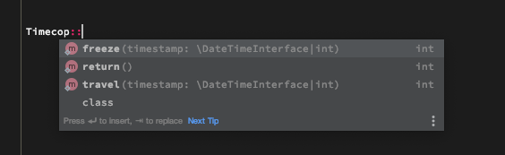
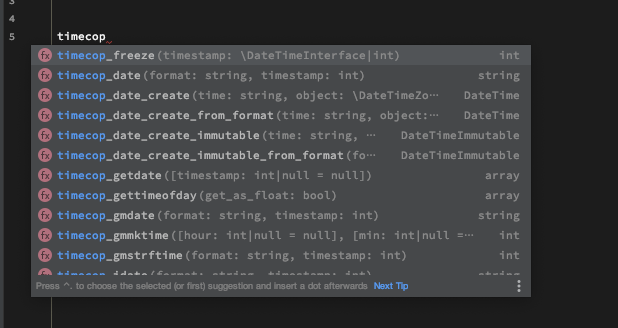

# timecop-stubs
This library supports stubs for timecop for IDE and static analyzing libraries.

- [hnw/php-timecop](https://github.com/hnw/php-timecop) 

# Installation

```
composer require-dev m3m0r7/timecop-stubs
```

# Screenshot
Supported Intellij IDEA.





# For Static Analyzer
If you use PHPStan it will receive an error which is an internal error when using Timecop.
However, installing this library can solve it.